# `nix-config`

My multi-host macOS (Darwin) Nix flake built with [flake-parts] and a dendritic
module layout. Manages three hosts from a single flake: a personal Mac mini, a
personal MacBook, and a work laptop.

## Prerequisites

- Nix 2.18+ with flakes enabled, **or** [Determinate Systems]' Nix installer
  (used on the personal hosts, which rely on Determinate's `determinateNix`
  module).
- [nix-darwin] (pulled in as a flake input — no standalone install needed).
- macOS on Apple Silicon (`aarch64-darwin`). `x86_64-darwin` is declared in
  `flake/per-system.nix` but untested.

## Before first build

Personal data (name, email, git usernames, SSH signing key names) is kept out of
version control. Before the first build:

```sh
mkdir -p ~/.config/nix-config
cp modules/data/private.toml.example ~/.config/nix-config/private.toml
```

Then edit `~/.config/nix-config/private.toml` with your actual values.

Build and switch with `--impure` so Nix can read the private file:

```sh
darwin-rebuild switch --flake .#MacMini --impure
```

## Hosts

| Configuration key     | Host            | Profile   | Home-manager machine        | Nix install  |
| --------------------- | --------------- | --------- | --------------------------- | ------------ |
| `darwinConfigurations.MacMini`           | personal Mac mini | `personal` | `darwin-personal.nix`  | Determinate  |
| `darwinConfigurations.MBA`           | personal MacBook  | `personal` | `darwin-personal.nix`  | Determinate  |
| `darwinConfigurations.PLN`  | work laptop       | `work`     | `darwin-pln.nix`       | system nix   |

The `system.stateVersion` constraint is embedded in each host file and must not
be changed (6 on the personal hosts, 4 on the work host).

## Usage

From this directory:

```sh
# Build / switch a host (run on the target machine).
# Private values (name, email, etc.) are loaded at eval time from
# ~/.config/nix-config/private.toml and require --impure.
sudo darwin-rebuild switch --flake .#MacMini --impure
sudo darwin-rebuild switch --flake .#MBA --impure
sudo darwin-rebuild switch --flake .#PLN --impure

# Evaluate a configuration without building
nix eval .#darwinConfigurations.MacMini.config.system.build.toplevel.drvPath

# Build a configuration without switching
nix build .#darwinConfigurations.MacMini.config.system.build.toplevel

# Flake sanity check
nix flake check --no-build
```

## Directory layout

```
nix-config/
├── flake.nix              # Thin mkFlake wrapper; all inputs declared here
├── flake.lock             # Generated
├── flake/                 # flake-parts modules
│   ├── darwin-configurations.nix   # Declares the flake.darwinConfigurations option
│   ├── inputs.nix                  # Empty imports; home-manager wired via mk-darwin.nix
│   └── per-system.nix             # Supported systems list
├── hosts/                 # Per-host flake-parts modules (thin)
│   ├── default.nix        # Aggregator: imports each host file explicitly
│   ├── macmini.nix
│   ├── macbook.nix
│   └── work.nix
├── modules/               # nix-darwin modules + the mkHost helper + shared data
│   ├── mk-darwin.nix      # mkHost { profile, home, hostConfig } -> darwinSystem
│   ├── overlays.nix       # Shared overlays (karabiner-elements pin)
│   ├── data/              # Per-user PII and config (private.toml from ~/.config/nix-config/ + --impure)
│   └── darwin/            # Feature-tree modules
│       ├── common.nix            # Shared: primaryUser, defaults, tailscale, EDITOR
│       ├── aerospace.nix         # Shared aerospace settings (per-host bits in hostConfig)
│       ├── jankyborders.nix      # Shared: unstable.jankyborders for both hosts
│       ├── touchid.nix           # Shared: PAM sudo_local touchId
│       ├── trackpad.nix          # Shared: trackpad defaults (tap, right-click, drag)
│       ├── homebrew-base.nix     # Shared: onActivation.cleanup = "zap"
│       ├── dev-tools.nix         # Shared: mole + gitu
│       ├── determinate.nix       # Personal only
│       ├── devenv.nix            # Shared: devenv for both profiles
│       ├── llm.nix               # Personal only (lmstudio)
│       ├── tsshd.nix             # Personal only (tsshd pkg + launchd agent)
│       ├── homebrew-personal.nix # homebrew.enable = false + personal casks
│       ├── homebrew-work.nix     # homebrew.enable = true  + work casks
│       ├── unfree-personal.nix   # unstable overlay + allowUnfreePredicate
│       ├── unfree-work.nix       # unstable overlay + allowUnfreePredicate
│       ├── packages-personal.nix # Personal system packages
│       ├── packages-work.nix     # Work system packages + nix.settings + zsh
│       ├── gc.nix                # Work only: weekly nh clean launchd agent
│       ├── thaw.nix              # Thaw menu bar manager (shared module, work-enabled)
│       ├── personal/default.nix  # Aggregator: imports personal feature modules
│       └── work/                 # Work feature modules
│           ├── default.nix       # Aggregator: imports work feature modules
│           ├── zscaler.nix       # Zscaler CA bundle + all TLS env vars (one concern, one file)
│           ├── karabiner.nix     # services.karabiner-elements.enable
│           └── yabai.nix         # yabai + skhd (coupled, dormant — flip enable to activate)
├── home-manager/          # home-manager config (user-level)
│   ├── machines/          # Per-host home-manager entry points
│   │   ├── darwin-personal.nix
│   │   ├── darwin-pln.nix
│   │   ├── nixos.nix
│   │   └── nixos-oracle.nix
│   └── modules/           # Shared home-manager modules
│       ├── core/          # Shell, prompt, git, editors, terminals, tmux, zellij
│       ├── darwin/core/   # Darwin-specific home-manager bits
│       ├── editors/       # helix, nvim
│       ├── terminals/     # kitty, wezterm
│       ├── tools/         # gh-dash, tuicr
│       ├── linux/         # Linux-only (sway, gui) — unused on Darwin
│       └── window-managers/
└── packages/              # Custom package definitions (callPackage sources)
    ├── thaw/              # Thaw menu bar manager (consumed by modules/darwin/thaw.nix)
    └── stackline/
```

## Architecture

### flake-parts

`flake.nix` is a four-line `mkFlake` wrapper. All flake inputs live
there (flake inputs are evaluated *before* `outputs` runs, so they
cannot be declared from inside flake-parts modules). Everything else is
split across `flake/`, `hosts/`, and `modules/`.

`flake/darwin-configurations.nix` declares the `flake.darwinConfigurations`
option with a proper `lazyAttrsOf raw` type. flake-parts ships a typed
`nixosConfigurations` option but not a `darwinConfigurations` one;
without this declaration, two host files setting
`flake.darwinConfigurations.<name>` collide on the freeform `unique`
type.

### Dendritic module layout

Each concern lives in its own module under `modules/darwin/`. Two
**aggregator** files pull feature modules together per profile:

- `modules/darwin/personal/default.nix`
- `modules/darwin/work/default.nix`

Host files (`hosts/*.nix`) are thin: they call `mkHost` with a
`profile` (an aggregator path), a `home` (home-manager machine path),
and a `hostConfig` attrset containing only per-host settings
(`stateVersion`, aerospace `on-window-detected` and
`workspace-to-monitor-force-assignment` lists).

`mkHost` (`modules/mk-darwin.nix`) wires the shared framework
modules (`overlays.nix`, `common.nix`), the profile, home-manager,
nixvim, and the per-host `hostConfig` into a `nix-darwin.lib.darwinSystem`
call. Window-manager and border-tool choices (`aerospace.nix`,
`jankyborders.nix`) live in the per-profile aggregators, so a future
host that doesn't want them simply omits the imports.

```mermaid
flowchart TD
    mkHost["mkHost<br/>modules/mk-darwin.nix"]

    mkHost --> overlays["overlays.nix"]
    mkHost --> common["common.nix"]
    mkHost --> home["home-manager machine"]
    mkHost --> hostConfig["hostConfig (per-host)"]
    mkHost --> personal["personal/default.nix"]
    mkHost --> work["work/default.nix"]

    personal --> P1["unfree-personal.nix"]
    personal --> P2["packages-personal.nix"]
    personal --> P3["llm.nix"]
    personal --> P4["tsshd.nix"]
    personal --> P5["devenv.nix"]
    personal --> P6["determinate.nix"]
    personal --> P7["homebrew-personal.nix"]

    work --> W1["unfree-work.nix"]
    work --> W2["packages-work.nix"]
    work --> W3["gc.nix"]
    work --> W4["zscaler.nix"]
    work --> W5["karabiner.nix"]
    work --> W6["yabai.nix"]
    work --> W7["homebrew-work.nix"]
    work --> W8["thaw.nix *"]
    work --> W9["devenv.nix"]

    personal --> S1["dev-tools.nix"]
    work --> S1
    personal --> S2["touchid.nix"]
    work --> S2
    personal --> S3["homebrew-base.nix"]
    work --> S3
    personal --> S4["aerospace.nix"]
    work --> S4
    personal --> S5["jankyborders.nix"]
    work --> S5
    personal --> S6["trackpad.nix"]
    work --> S6

    classDef shared fill:#e8f5e9,stroke:#2e7d32;
    classDef always fill:#e3f2fd,stroke:#1565c0;
    class overlays,common always;
    class S1,S2,S3,S4,S5,S6 shared;
```



Blue nodes are wired into every host by `mkHost` itself. Green nodes
are imported by **both** aggregators (true sharing). `thaw.nix` (`*`)
is a reusable module but only the work aggregator imports it today,
with `programs.thaw.enable = true` set in `packages-work.nix`.

### Personal vs. work split

The split is by **concern**, not by host. Examples:

- `determinate.nix` — personal only (work uses system nix).
- `gc.nix` — work only (Determinate handles GC on personal hosts).
- `zscaler.nix` — work only (TLS interception trust bundle + env vars).
- `dev-tools.nix` — shared (`mole` + `gitu` on every host).
- `devenv.nix` — shared (imported by both aggregators).
- `touchid.nix`, `homebrew-base.nix` — shared.
- `thaw.nix` — shared module, but only the work aggregator sets
  `programs.thaw.enable = true`. Personal can opt in by adding the
  import + toggle.

### home-manager

Home-manager is wired in via `home-manager.darwinModules.home-manager`
in `mkHost`. The machine files (`home-manager/machines/*.nix`) set
`home-manager.useGlobalPkgs` / `useUserPackages` and declare
`home-manager.users.${username}` (username from `modules/data`). Shared home-manager config lives in
`home-manager/modules/core`, which branches on `local.core.work.enable`
and `local.core.zscaler.enable` (set per-machine) for things like git
identity, signing keys, and SSL cert paths.

## Common tasks

### Add a system package

- **Personal only:** add to `modules/darwin/packages-personal.nix`.
- **Work only:** add to `modules/darwin/packages-work.nix`.
- **Both hosts:** add to `modules/darwin/dev-tools.nix` (or another
  shared module), and ensure both aggregators import it.

If the package is unfree, also add its `lib.getName` to the matching
`unfree-personal.nix` / `unfree-work.nix` predicate(s). Packages pulled
from `pkgs.unstable.*` need to be whitelisted in the unstable-import
predicate (a separate nixpkgs evaluation — the stable
`allowUnfreePredicate` does not propagate to it).

### Add a Homebrew cask

Edit `homebrew-personal.nix` or `homebrew-work.nix`. Note
`homebrew.onActivation.cleanup = "zap"` (in `homebrew-base.nix`) means
casks not declared here are uninstalled on `darwin-rebuild switch`.

### Add a new host

1. Create `hosts/<name>.nix` modeled on `macmini.nix` / `work.nix`.
2. Add `./<name>.nix` to `hosts/default.nix`.
3. Add a `home-manager/machines/<name>.nix` and point `home =` at it.

That's it — `flake.nix` does not need editing (the host count is
discovered via `hosts/default.nix`).

### Add a new feature module

1. Create `modules/darwin/<feature>.nix` (or `modules/darwin/<profile>/<feature>.nix`
   for profile-specific).
2. Add it to the relevant aggregator's `imports` list
   (`personal/default.nix` and/or `work/default.nix`).

### Update flake inputs

```sh
nix flake update              # all inputs
nix flake update nixpkgs      # one input
nix flake update --flake .    # from outside the directory
```

`nix-darwin`, `home-manager`, `mole-nix`, and `lumen` all
`follows = "nixpkgs"`, so updating `nixpkgs` moves them in lockstep. `nixvim`
pins its own nixpkgs (`nixos-26.05`), while `maki-nix`, `tiny-harness-nix`, and
`herdr-nix` deliberately follow `nixpkgs-unstable` (they build against a
separate nixpkgs evaluation). `flake-parts` does **not** have a `nixpkgs` input
(it uses `nixpkgs-lib`).

[flake-parts]: https://github.com/hercules-ci/flake-parts
[Determinate Systems]: https://determinate.systems/
[nix-darwin]: https://github.com/LnL7/nix-darwin
